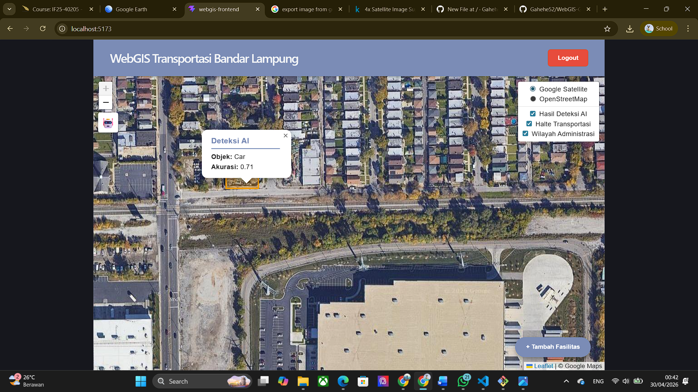
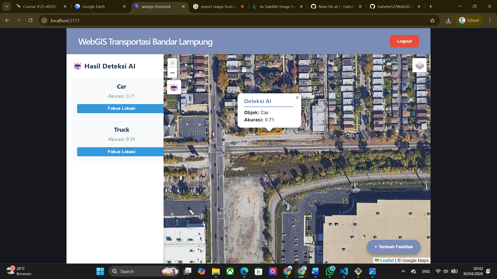

# WebGIS Fasilitas Publik & Spatial AI (Tugas 10) 🗺️🤖

Repositori ini berisi pengembangan sistem **WebGIS Full-Stack** yang mengintegrasikan Manajemen Data Spasial dengan teknologi **Spatial AI** untuk deteksi objek otomatis pada citra satelit/aerial. Proyek ini merupakan pemenuhan **Tugas Praktikum 10 - Mata Kuliah Sistem Informasi Geografis**.

## 👤 Profil Mahasiswa
- **Nama**: Muhammad Ghama Al Fajri
- **NIM**: 123140182
- **Program Studi**: Teknik Informatika
- **Instansi**: Institut Teknologi Sumatera (ITERA)

## 🚀 Fitur Utama (Update Tugas 10)
1. **Spatial AI Detection (YOLOv8)**:
   - Implementasi deteksi objek otomatis menggunakan model **YOLOv8** (Pre-trained).
   - Fitur **Image Tiling** untuk memproses citra resolusi tinggi dengan memotongnya menjadi bagian-bagian kecil (tile) sebelum dianalisis model.
   - Ekstraksi informasi objek (mobil, truk, bus, motor) dan konversi koordinat piksel menjadi koordinat geografis.
   - **Reproyeksi Koordinat**: Menggunakan `pyproj` untuk mengubah sistem koordinat gambar (seperti UTM) menjadi format WGS 84 (Longitude/Latitude) agar sesuai dengan peta WebGIS.
   - Ekspor hasil deteksi secara otomatis ke format **GeoJSON**.

2. **UI Interaktif & Extra Work**:
   - **Sidebar Deteksi AI**: Panel menu samping untuk menampilkan daftar seluruh objek yang ditemukan oleh AI secara terstruktur.
   - **Fitur Fokus Lokasi**: Tombol khusus pada setiap item deteksi yang memungkinkan peta "terbang" (*flyTo*) dan melakukan *zoom* otomatis ke lokasi objek yang dipilih.
   - **Autentikasi JWT & CRUD**: Sistem login aman dan manajemen data halte yang tetap terintegrasi dari tugas sebelumnya.

## 🛠️ Arsitektur Teknologi
- **Backend**: FastAPI (Python).
- **AI Engine**: Ultralytics YOLOv8.
- **Geospatial Processing**: Rasterio & PyProj.
- **Frontend**: React.js & Leaflet (React-Leaflet).
- **Database**: PostgreSQL dengan ekstensi PostGIS.

## ⚙️ Cara Menjalankan

### 1. Persiapan AI Pipeline
Pastikan virtual environment aktif, simpan citra sampel sebagai `sample.tif`, lalu jalankan ekstraksi:
```bash
pip install -r requirements.txt
python ai_pipeline.py
```
*Script ini akan menghasilkan file `detections.geojson` berdasarkan analisis citra.*

### 2. Menjalankan Backend (FastAPI)
```bash
uvicorn main:app --reload
```
API akan tersedia di `http://localhost:8000` dan menyediakan endpoint `/api/ai/detections/geojson`.

### 3. Menjalankan Frontend (React)
```bash
cd webgis-frontend
npm install
npm run dev
```
Akses WebGIS di `http://localhost:5173`. Klik ikon robot 🤖 di pojok kiri untuk membuka daftar deteksi AI.

---
## Screenshot Hasil

| Hasil deteksi ai dan checkbox tampilan |  Sidebar opsi fokus (fly-to) ke hasil deteksi AI |
| :---: | :---: |
|  |  |

*untuk referensi sample, bisa dilihat pada sample.tif (lokasi deteksi akan sesuai sample.tif)
